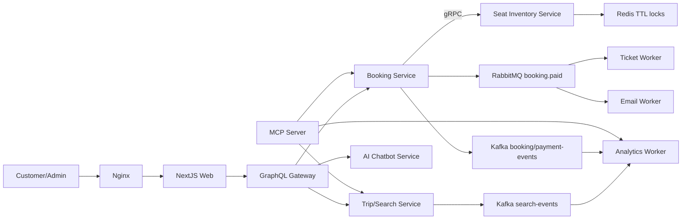

# Hệ thống đặt vé xe khách liên tỉnh tích hợp AI

Project cuối kì cho học phần Xây dựng phần mềm Web, bám theo đề: NextJS, GraphQL Gateway, gRPC service-to-service, Microservices, Redis, RabbitMQ/Kafka, Nginx, AI SDK và MCP Server.

## Kiến trúc



## Chức năng chính

- Tìm chuyến theo điểm đi, điểm đến, ngày đi; lọc theo giờ, giá, nhà xe, loại xe, số ghế còn lại.
- GraphQL query/mutation/subscription cho web app.
- Chọn ghế và giữ ghế bằng Redis TTL qua gRPC `SeatInventoryService`.
- Booking guest checkout, thanh toán mô phỏng, sinh vé điện tử, log email mô phỏng.
- Admin quản lý tuyến/chuyến, khóa ghế, check-in, xem doanh thu và top tuyến.
- Kafka analytics cho `search-events`, `booking-events`, `payment-events`.
- Chatbot dùng AI SDK tool calling khi có `OPENAI_API_KEY`; nếu không có key sẽ dùng assistant rule-based nhưng vẫn gọi tool nội bộ.
- MCP server cung cấp tools `search_trips`, `get_trip_detail`, `get_booking_status`, `get_revenue_summary`, `get_popular_routes` và resources chính sách.

## Chạy local nhanh

```bash
npm install
copy .env.example .env
npm run dev
```

Các cổng mặc định:

- Web: http://localhost:3000
- GraphQL: http://localhost:4000/graphql
- Trip service: http://localhost:4010
- Booking service: http://localhost:4020
- Analytics worker HTTP: http://localhost:4050
- AI service: http://localhost:4100
- Seat gRPC: `localhost:50051`

Redis/RabbitMQ/Kafka là tùy chọn khi chạy `npm run dev`; nếu chưa bật hạ tầng, service dùng fallback in-memory và ghi log để demo vẫn chạy.

## Chạy đủ hạ tầng bằng Docker

```bash
npm run docker:up
```

Sau đó mở:

- App qua Nginx: http://localhost
- Web trực tiếp: http://localhost:3000
- GraphQL Gateway: http://localhost:4000/graphql
- RabbitMQ management: http://localhost:15672, user/pass `guest/guest`

Các lệnh Docker tiện dùng:

```bash
npm run docker:config  # kiểm tra docker-compose.yml
npm run docker:build   # build image Node dùng chung cho app/services/workers
npm run docker:logs    # xem log toàn hệ thống
npm run docker:down    # dừng và xóa container network
```

Compose tạo network `bus-network`, chạy Redis, RabbitMQ, Kafka, Nginx và toàn bộ microservices. Nginx là cửa vào chính, route `/` đến NextJS và `/graphql` đến GraphQL Gateway.

## Test yêu cầu tranh chấp ghế

```bash
npm test
```

Test `seat-race.test.js` mô phỏng hai người cùng giữ ghế A01 trong cùng một chuyến; chỉ một request thành công.

## Tài khoản demo

- Admin: `admin@bus.local` / `admin123`
- Staff: `staff@bus.local` / `staff123`
- Customer có thể checkout dạng guest, không bắt buộc đăng nhập.

## MCP Server

```bash
npm run start:mcp
```

MCP server chạy qua stdio để AI client bên ngoài gọi tool tra cứu chuyến, booking, doanh thu và đọc resource chính sách.
