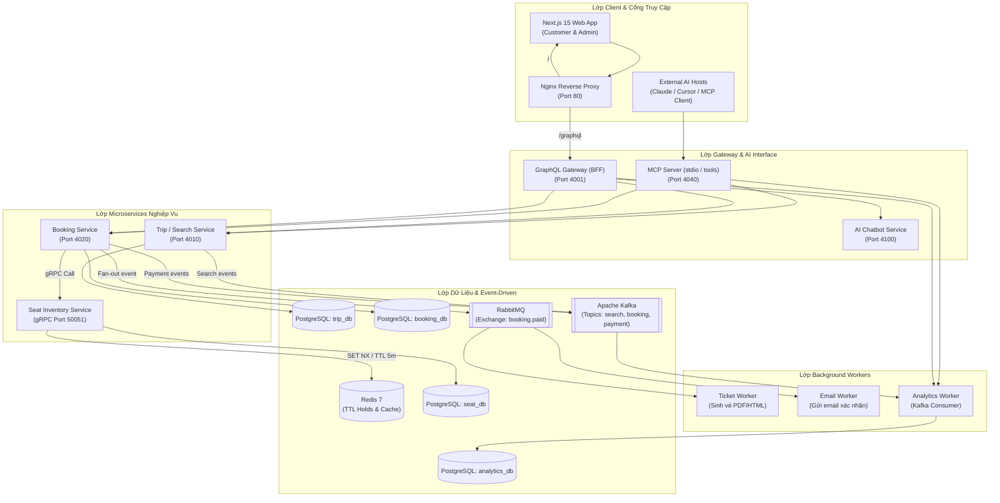

# 🚌 Hệ Thống Đặt Vé Xe Khách Liên Tỉnh Tích Hợp AI (Bus AI Ticketing)

> **Đồ án môn học / Dự án tốt nghiệp**: Xây dựng hệ thống phân tán đặt vé xe khách liên tỉnh quy mô lớn, tích hợp trợ lý ảo AI, kiến trúc Microservices, GraphQL Gateway (BFF), gRPC Service-to-Service, Redis Distributed Locks (TTL Hold), RabbitMQ & Apache Kafka Event-Driven Architecture, PostgreSQL (Database-per-service), Nginx Reverse Proxy và Model Context Protocol (MCP) Server.

---

## 👥 Bảng Phân Công & Chi Tiết Đóng Góp Của Các Thành Viên

| STT | Thành Viên | Vai Trò Chính | Module / Trách Nhiệm Phụ Trách | Mức Độ Hoàn Thành |
|:---:|---|---|---|:---:|
| 1 | **Trần Trung Kiên** | **Frontend Engineer** | Giao diện khách hàng (Customer Portal), Tìm chuyến, Sơ đồ chọn ghế, Tra cứu vé, Quản lý tài khoản, Design System & Responsive UI | **100%** |
| 2 | **Xuân Hưng** | **Backend Core Engineer** | Dịch vụ Đặt vé (Booking Service), Quản lý tồn kho ghế (Seat Inventory Service gRPC), Cơ chế khóa ghế phân tán (Redis Lock), Xử lý đồng thời (Concurrency) & ACID | **100%** |
| 3 | **Việt Khải** | **Fullstack & DevOps Lead** | Giao diện Quản trị (Admin Portal), Trợ lý ảo AI Chatbot (AI SDK), MCP Server, GraphQL Gateway (BFF), Kafka & RabbitMQ Workers, Hạ tầng Docker Compose & Tài liệu kỹ thuật | **100%** |

---

### 1. 👤 Trần Trung Kiên — Frontend & Trải Nghiệm Khách Hàng (Customer Experience)

* **Vai trò**: Phụ trách toàn bộ giao diện phía khách hàng trên nền tảng **Next.js 15 (App Router)**, tối ưu UI/UX, tương tác thời gian thực và trải nghiệm người dùng cuối.
* **Các module & tính năng đã thực hiện**:
  * **Trang chủ & Tìm kiếm chuyến xe (`apps/web/src/app/page.jsx`)**:
    * Thanh tìm kiếm thông minh với gợi ý địa điểm (điểm đi, điểm đến, ngày khởi hành).
    * Bộ lọc đa tiêu chí: Lọc theo khung giờ khởi hành (Sáng: 00:00 - 06:00, Trưa: 06:00 - 12:00, Chiều: 12:00 - 18:00, Tối: 18:00 - 24:00), khoảng giá vé, nhà xe, hạng xe (Limousine, Giường nằm, Ghế ngồi cao cấp).
    * Sắp xếp linh hoạt theo giá tăng/giảm dần, giờ khởi hành sớm/muộn nhất, đánh giá nhà xe.
  * **Sơ đồ chọn ghế trực quan thời gian thực (`apps/web/src/app/trips/[id]/page.jsx`, `apps/web/src/components/SeatMap.jsx`)**:
    * Mô phỏng sơ đồ xe 2 tầng (Tầng dưới / Tầng trên) trực quan, hiển thị rõ ràng vị trí tài xế, cửa lên xuống.
    * Trạng thái ghế đa dạng: Ghế trống, Ghế đang được chọn, Ghế đang được giữ tạm thời (Holding - kèm countdown TTL 5 phút), Ghế đã bán (Sold), Ghế bị khóa bởi quản trị viên (Blocked).
    * Form nhập thông tin hành khách chi tiết theo từng ghế đã chọn (Họ tên, Số điện thoại, Email, Số CMND/CCCD).
  * **Tra cứu và hiển thị vé điện tử E-Ticket (`apps/web/src/app/booking/[code]/page.jsx`)**:
    * Tra cứu vé tiện lợi bằng **Mã đặt vé (Booking Code) + Email**.
    * Hiển thị vé điện tử trực quan với đầy đủ thông tin hành khách, biển số xe, vị trí ghế, thời gian đón/trả và **Mã QR Code** phục vụ check-in.
    * Hỗ trợ chức năng in vé / xuất file PDF và yêu cầu hủy vé trực tuyến kèm kiểm tra điều kiện hoàn tiền.
  * **Trang tài khoản khách hàng (`apps/web/src/app/account/page.jsx`)**:
    * Đăng nhập / Đăng ký người dùng demo.
    * Quản lý sổ địa chỉ hành khách thường dùng (Saved Passengers) để tự động điền nhanh khi đặt vé.
    * Lịch sử các chuyến đi đã đặt kèm trạng thái thanh toán và liên kết xem lại vé.
  * **Trang chính sách & SEO Landing Page**:
    * Trang quy định chính sách hủy vé & hoàn tiền (`apps/web/src/app/cancellation-policy/page.jsx`).
    * Dynamic SEO Routes (`apps/web/src/app/routes/[from]/[to]/page.jsx`) tối ưu tìm kiếm theo từng tuyến liên tỉnh.
  * **Design System & Responsive Shell (`apps/web/src/app/globals.css`, `SiteChrome.jsx`, `ChatWidget.jsx`)**:
    * Thiết kế giao diện hiện đại (Modern UI), chuẩn màu sắc, typography, card layout, micro-interactions.
    * Tối ưu hiển thị responsive hoàn hảo trên Mobile, Tablet và Desktop.
    * Tích hợp GraphQL Client (`apps/web/src/lib/graphql.js`) kết nối Gateway xử lý Query, Mutation và SSE Subscription.

---

### 2. 👤 Xuân Hưng — Backend Core, Nghiệp Vụ Đặt Vé & Xử Lý Đồng Thời (Concurrency)

* **Vai trò**: Phụ trách logic nghiệp vụ lõi (Core Business Logic), quản lý vòng đời đặt vé, kiểm soát tồn kho ghế theo thời gian thực và giải quyết bài toán xung đột tranh chấp ghế (Race Condition).
* **Các module & tính năng đã thực hiện**:
  * **Dịch vụ Đặt vé — Booking Service (`services/booking-service/`)**:
    * Thiết kế và hiện thực **Booking State Machine** nghiêm ngặt:
      $$\text{PENDING} \longrightarrow \text{HOLD} \longrightarrow \text{PAYMENT\_PROCESSING} \longrightarrow \text{PAID} \longrightarrow \text{TICKET\_ISSUED} \longrightarrow \text{CHECKED\_IN}$$
      *(Hỗ trợ các trạng thái kết thúc: `CANCELLED`, `EXPIRED`, `REFUNDED`)*.
    * Quy trình checkout an toàn: Kiểm tra hợp lệ hold token, khóa danh sách ghế tương ứng với từng hành khách cụ thể.
    * Hỗ trợ 2 hình thức checkout: **Registered User** (liên kết tài khoản) và **Guest Checkout** (truy cập bảo mật qua capability mã vé + email).
    * Thanh toán mô phỏng (Simulated Payment Gateway) tích hợp **Idempotency Key** chống thanh toán lặp khi retry mạng.
    * Xử lý chính sách hủy vé: Tự động tính toán thời gian trước giờ khởi hành để quyết định hoàn tiền hoặc từ chối hủy khi vé đã check-in / xe đã xuất bến.
    * Phát sự kiện nghiệp vụ (`BookingPaid`, `PaymentSucceeded`, `BookingCancelled`) sang RabbitMQ và Apache Kafka.
  * **Dịch vụ Tồn kho ghế — Seat Inventory Service (`services/seat-service/`)**:
    * Xây dựng service giao tiếp liên dịch vụ qua **gRPC Protocol** chuẩn (`proto/seat_inventory.proto`).
    * Cơ chế giữ ghế phân tán (Distributed Seat Hold): Sử dụng **Redis TTL locks (5 phút)** với lệnh nguyên tử `SET NX` để đảm bảo **tại một thời điểm chỉ duy nhất 1 người giữ được 1 ghế**.
    * Xác nhận ghế bền vững (Permanent Seat Assignment) vào cơ sở dữ liệu `seat_db` khi đơn hàng chuyển sang trạng thái `PAID`.
    * Hiện thực đầy đủ 4 mô hình giao tiếp gRPC:
      1. *Unary RPC*: `HoldSeats`, `ConfirmSeats`, `ReleaseSeats`, `GetSeatLayout`.
      2. *Server Streaming RPC*: `StreamSeatUpdates` (bắn luồng thay đổi ghế).
      3. *Client Streaming RPC*: `BatchSeatOperations`.
      4. *Bidirectional Streaming RPC*: `SyncSeatStates`.
  * **Dịch vụ Chuyến xe — Trip Service (`services/trip-service/`)**:
    * Quản lý danh mục tuyến đường (Routes), trạm đón/trả, xe khách (Vehicles), lịch trình (Trips).
    * API tìm kiếm chuyến xe tốc độ cao, hỗ trợ bộ lọc đa dạng và cache kết quả tìm kiếm với Redis.
  * **Kiểm thử Concurrency & Bảo đảm toàn vẹn dữ liệu (`tests/`)**:
    * Xây dựng bộ kiểm thử tranh chấp ghế đa luồng `tests/seat-race.test.js` và `tests/seat-race-stress.test.js` (mô phỏng đồng thời nhiều client cùng tranh giành 1 ghế tại cùng 1 mili-giây).
    * Kiểm thử toàn vẹn dữ liệu nghiệp vụ `tests/booking-domain.test.js`, `tests/booking-validation.test.js`.

---

### 3. 👤 Việt Khải — Fullstack, AI Chatbot, Event-Driven Architecture & DevOps Lead

* **Vai trò**: Phụ trách phát triển Cổng Quản trị (Admin Portal), Tích hợp Trợ lý Trí tuệ Nhân tạo (AI Chatbot), Model Context Protocol (MCP) Server, GraphQL Gateway, Hệ thống Worker xử lý sự kiện bất đồng bộ, Kiến trúc Container Docker và Bộ tài liệu kỹ thuật.
* **Các module & tính năng đã thực hiện**:
  * **Cổng Quản trị Hệ thống — Admin Portal (`apps/web/src/app/admin/page.jsx`)**:
    * Quản lý CRUD toàn diện: Tuyến đường, Chuyến xe, Xe khách, Lịch chạy, Giá vé.
    * Tính năng **Khóa/Mở ghế thủ công (Admin Block/Unblock Seats)** dành cho điều hành nhà xe.
    * Tính năng **Check-in vé trực tiếp tại bến**: Tra cứu mã vé, đối soát CMND/CCCD và quét QR code cập nhật trạng thái `CHECKED_IN`.
    * Bảng điều khiển giám sát Dashboard: Biểu đồ doanh thu thời gian thực, tỷ lệ lấp đầy ghế (Seat Occupancy Rate), Top tuyến xe mang lại doanh thu cao nhất, Báo cáo vận hành.
  * **Dịch vụ Trợ lý AI — AI Service (`services/ai-service/`)**:
    * Tích hợp **Vercel AI SDK** hỗ trợ cơ chế **Function Calling (Tool Calling)** thông minh:
      * Tự động tra cứu chuyến xe theo yêu cầu bằng ngôn ngữ tự nhiên (`search_trips`).
      * Tra cứu trạng thái vé an toàn sau khi xác thực mã vé + email khách hàng (`get_booking_status`).
      * Giải đáp chính sách hoàn/hủy vé, quy định hành lý dựa trên dữ liệu chính sách thực tế.
    * Xây dựng cơ chế **Smart AI Fallback Engine** (Intent Classifier + Rule-based Tool Runner): Hoạt động mượt mà, đầy đủ tính năng ngay cả khi không có kết nối internet hoặc không có OpenAI API Key.
  * **Model Context Protocol — MCP Server (`services/mcp-server/`)**:
    * Xây dựng MCP Server chuẩn qua giao thức stdio theo đặc tả của Anthropic / Open Protocol.
    * Cung cấp danh mục **Tools**: `search_trips`, `get_trip_detail`, `get_booking_status`, `get_revenue_summary`, `get_popular_routes`.
    * Cung cấp danh mục **Resources**: `policy://cancellation`, `policy://baggage`, `health://status`.
    * Cho phép các AI Client bên ngoài (Claude Desktop, Antigravity, Cursor) kết nối và thao tác trực tiếp với hệ sinh thái đặt vé.
  * **GraphQL Gateway — Backend For Frontend (`services/gateway/`)**:
    * Điểm tiếp nhận duy nhất cho Client Web, tổng hợp schema từ các microservice con.
    * Cung cấp GraphQL Query, Mutation và Subscription (`seatChanged` qua Server-Sent Events / SSE) giúp cập nhật trạng thái ghế tức thời lên giao diện người dùng.
  * **Hệ thống Worker hướng sự kiện (Event-Driven Workers)**:
    * `workers/analytics-worker`: Consumer Kafka lắng nghe các topic `search-events`, `booking-events`, `payment-events` để tổng hợp số liệu thống kê doanh thu và hành vi người dùng (đảm bảo tính idempotent qua `event_id`).
    * `workers/ticket-worker` & `workers/email-worker`: Consumer RabbitMQ nhận sự kiện fan-out `booking.paid` từ exchange để tự động sinh vé điện tử HTML/PDF và gửi email xác nhận cho khách hàng (có retry exponential backoff và Dead Letter Queue - DLQ).
  * **Kiến trúc Hạ tầng Docker Compose & DevOps (`docker-compose.yml`, `infra/`, `nginx/`, `scripts/`)**:
    * Đóng gói toàn bộ hệ sinh thái dịch vụ với Docker Compose: Nginx Reverse Proxy, 4 Database PostgreSQL logic tách biệt theo nguyên tắc Database-per-Service, Redis, RabbitMQ, Apache Kafka & Zookeeper.
    * Tích hợp cơ chế gRPC Healthcheck (`grpc.health.v1.Health/Check`) đảm bảo thứ tự khởi động an toàn giữa các container.
    * Viết script tự động hóa Migration và Seed dữ liệu mẫu đa dạng (`scripts/db-tasks.js`).
  * **Tài liệu Kỹ thuật Dự án (`docs/`)**:
    * Soạn thảo toàn bộ hồ sơ thiết kế kiến trúc: [Kiến trúc Backend](file:///d:/khai/H-th-ng-t-v-xe-kh-ch-li-n-t-nh-t-ch-h-p-AI/docs/backend-architecture.md), [Đảm bảo tính chất ACID](file:///d:/khai/H-th-ng-t-v-xe-kh-ch-li-n-t-nh-t-ch-h-p-AI/docs/acid-guarantees.md), [Đối chiếu yêu cầu đề tài](file:///d:/khai/H-th-ng-t-v-xe-kh-ch-li-n-t-nh-t-ch-h-p-AI/docs/requirements-traceability.md), [Runbook vận hành](file:///d:/khai/H-th-ng-t-v-xe-kh-ch-li-n-t-nh-t-ch-h-p-AI/docs/RUNBOOK.md).

---

## 🏛️ Sơ Đồ Kiến Trúc Hệ Thống (Architecture Diagram)


```mermaid
flowchart TB
    subgraph ClientLayer["Lớp Client & Cổng Truy Cập"]
        Web["Next.js 15 Web App\n(Customer & Admin)"]
        AIClient["External AI Hosts\n(Claude / Cursor / MCP Client)"]
        Nginx["Nginx Reverse Proxy\n(Port 80)"]
    end

    subgraph GatewayLayer["Lớp Gateway & AI Interface"]
        GW["GraphQL Gateway (BFF)\n(Port 4001)"]
        MCP["MCP Server (stdio / tools)\n(Port 4040)"]
        AISvc["AI Chatbot Service\n(Port 4100)"]
    end

    subgraph ServiceLayer["Lớp Microservices Nghiệp Vụ"]
        TripSvc["Trip / Search Service\n(Port 4010)"]
        BookingSvc["Booking Service\n(Port 4020)"]
        SeatSvc["Seat Inventory Service\n(gRPC Port 50051)"]
    end

    subgraph EventAndStorage["Lớp Dữ Liệu & Event-Driven"]
        Redis[("Redis 7\n(TTL Holds & Cache)")]
        TDB[("PostgreSQL: trip_db")]
        BDB[("PostgreSQL: booking_db")]
        SDB[("PostgreSQL: seat_db")]
        ADB[("PostgreSQL: analytics_db")]
        RabbitMQ[["RabbitMQ\n(Exchange: booking.paid)"]]
        Kafka[["Apache Kafka\n(Topics: search, booking, payment)"]]
    end

    subgraph WorkerLayer["Lớp Background Workers"]
        TicketWorker["Ticket Worker\n(Sinh vé PDF/HTML)"]
        EmailWorker["Email Worker\n(Gửi email xác nhận)"]
        AnalyticsWorker["Analytics Worker\n(Kafka Consumer)"]
    end

    %% Client Routing
    Web --> Nginx
    Nginx -->|/graphql| GW
    Nginx -->|/| Web
    AIClient --> MCP
    MCP --> TripSvc
    MCP --> BookingSvc
    MCP --> AnalyticsWorker

    %% Gateway Routing
    GW --> TripSvc
    GW --> BookingSvc
    GW --> AISvc
    GW --> AnalyticsWorker

    %% Inter-service & Storage
    TripSvc --> TDB
    TripSvc -->|Search events| Kafka
    BookingSvc --> BDB
    BookingSvc -->|gRPC Call| SeatSvc
    SeatSvc --> SDB
    SeatSvc -->|SET NX / TTL 5m| Redis
    BookingSvc -->|Fan-out event| RabbitMQ
    BookingSvc -->|Payment events| Kafka

    %% Workers
    RabbitMQ --> TicketWorker
    RabbitMQ --> EmailWorker
    Kafka --> AnalyticsWorker
    AnalyticsWorker --> ADB
```

---

## 🛠️ Công Nghệ Sử Dụng (Tech Stack)

* **Frontend**: Next.js 15 (App Router), React 19, Vanilla CSS Design System, Lucide Icons, QRCode SVG.
* **API Gateway & Protocol**: GraphQL (Apollo Server/Yoga BFF), gRPC (`@grpc/grpc-js`, `@grpc/proto-loader`), Server-Sent Events (SSE), RESTful APIs.
* **AI & Tool Calling**: Vercel AI SDK (`@ai-sdk/openai`), Model Context Protocol SDK (`@modelcontextprotocol/sdk`).
* **Database & Caching**: PostgreSQL 16 (4 Logical Databases), Redis 7 (In-Memory Key-Value & TTL Locks).
* **Message Broker & Streaming**: RabbitMQ 3.13 (AMQP 0-9-1), Apache Kafka 3.7 & Zookeeper.
* **Reverse Proxy & Container**: Nginx Alpine, Docker & Docker Compose.
* **Testing & Tools**: Node.js Test Runner (`node --test`), Concurrently.

---

## 🌐 Danh Sách Cổng Kết Nối & Endpoints Mặc Định

| Thành Phần | Giao Thức / Loại | Cổng Mặc Định (Port) | Đường Dẫn / URL |
|---|:---:|:---:|---|
| **Nginx Main Entry** | HTTP | `80` | `http://localhost` |
| **Next.js Web App** | HTTP | `3001` | `http://localhost:3001` |
| **GraphQL Gateway** | HTTP / GraphQL | `4001` | `http://localhost:4001/graphql` |
| **Trip Service** | HTTP REST | `4010` | `http://localhost:4010/health` |
| **Booking Service** | HTTP REST | `4020` | `http://localhost:4020/health` |
| **Analytics Worker API**| HTTP REST | `4050` | `http://localhost:4050/api/analytics/summary` |
| **AI Chatbot Service** | HTTP REST | `4100` | `http://localhost:4100/health` |
| **Seat Inventory Service**| **gRPC** | `50051` | `localhost:50051` |
| **PostgreSQL Database** | TCP / SQL | `5432` | `localhost:5432` (User: `postgres`, Pass: `postgres`) |
| **Redis Server** | TCP | `6379` | `localhost:6379` |
| **RabbitMQ Management** | HTTP Web UI | `15672` | `http://localhost:15672` (User/Pass: `guest/guest`) |
| **Apache Kafka Broker** | TCP | `9092` | `localhost:9092` |

---

## 🚀 Hướng Dẫn Cài Đặt & Khởi Chạy

### 1. Yêu cầu môi trường
* **Node.js**: Phiên bản `>= 20.x` (Khuyến nghị Node.js 22 LTS).
* **Docker & Docker Desktop**: Để chạy toàn bộ hệ thống bằng Container.
* **Git**: Để quản lý mã nguồn.

### 2. Khởi chạy nhanh toàn bộ hệ thống bằng Docker (Khuyến nghị)

Chỉ với 2 câu lệnh, toàn bộ 4 Database, Redis, RabbitMQ, Kafka, Nginx, Gateway, Web App, AI Service và các Workers sẽ tự động chạy:

```bash
# 1. Tạo file cấu hình môi trường từ mẫu
cp .env.example .env

# 2. Build và khởi động toàn bộ containers
npm run docker:up
```

Sau khi hoàn tất khởi động:
* Truy cập ứng dụng qua Nginx: **[http://localhost](http://localhost)**
* Truy cập trực tiếp Web Next.js: **[http://localhost:3001](http://localhost:3001)**
* Truy cập GraphQL Playground: **[http://localhost:4001/graphql](http://localhost:4001/graphql)**
* Xem RabbitMQ Dashboard: **[http://localhost:15672](http://localhost:15672)** *(Tài khoản: `guest` / `guest`)*

Các lệnh Docker hữu ích:
```bash
npm run docker:logs     # Xem log thời gian thực của toàn bộ hệ thống
npm run docker:down     # Dừng và dọn dẹp containers
npm run docker:config   # Kiểm tra tính hợp lệ của file docker-compose.yml
```

---

### 3. Khởi chạy môi trường phát triển (Local Development)

Nếu muốn chạy trực tiếp trên máy host để phát triển từng service:

```bash
# 1. Cài đặt toàn bộ dependencies trong monorepo
npm install

# 2. Tạo file cấu hình môi trường
cp .env.example .env

# 3. Chạy migration và seed dữ liệu mẫu vào database
npm run db:migrate
npm run db:seed

# 4. Khởi chạy đồng thời tất cả các dịch vụ (Web, Gateway, Services, Workers)
npm run dev
```

---

## 🧪 Kiểm Thử Hệ Thống (Testing & Concurrency Verification)

Hệ thống được trang bị bộ test tự động toàn diện với hơn 70 kịch bản kiểm thử:

```bash
# Chạy toàn bộ test suites
npm test

# Chạy riêng kịch bản kiểm tra xung đột giữ ghế đồng thời (Seat Race Condition)
npm run test:seat-race

# Chạy stress test lặp lại 3 lần liên tiếp (50 lượt race mỗi lần)
npm run test:seat-race:repeat
```

> **Đặc tả kiểm thử Race Condition (`tests/seat-race.test.js`)**:
> * Mô phỏng 2 hoặc nhiều khách hàng gửi request giữ cùng một ghế (ví dụ: `A01`) trên cùng chuyến xe tại cùng một mili-giây.
> * Kết quả: **Chỉ duy nhất 1 request thành công nhận `holdToken`**, các request còn lại nhận phản hồi `SEAT_ALREADY_HELD` hoặc `CONFLICT`.
> * Kiểm tra cơ chế tự động nhả ghế (Release Seat) khi hết hạn TTL 5 phút hoặc khi khách hàng hủy chọn.

---

## 🔑 Tài Khoản Demo Hệ Thống

| Vai Trò | Email Đăng Nhập | Mật Khẩu | Quyền Hạn |
|---|---|---|---|
| **Quản trị viên (Admin)** | `admin@bus.local` | `admin123` | Toàn quyền quản trị tuyến, chuyến, khóa ghế, check-in và xem báo cáo |
| **Nhân viên (Staff)** | `staff@bus.local` | `staff123` | Quản lý chuyến xe, soát vé và check-in khách hàng |
| **Khách hàng (Customer)** | `customer@bus.local` | `customer123` | Đặt vé, lưu hành khách, xem lịch sử đặt vé |
| **Khách vãng lai (Guest)** | *(Không cần đăng nhập)* | — | Tra cứu và quản lý vé bằng **Mã đặt vé + Email** |

---

## 🤖 Khởi Chạy Model Context Protocol (MCP) Server

Để kết nối hệ thống với các ứng dụng AI như Claude Desktop, Antigravity hoặc Cursor:

```bash
npm run start:mcp
```

### Danh mục công cụ MCP (Tools):
* `search_trips`: Tìm chuyến xe theo điểm đi, điểm đến và ngày khởi hành.
* `get_trip_detail`: Lấy chi tiết lịch trình, bảng giá và sơ đồ ghế của chuyến xe.
* `get_booking_status`: Tra cứu thông tin vé và trạng thái thanh toán bằng mã vé + email.
* `get_revenue_summary`: Xem báo cáo doanh thu theo ngày/tháng và tỷ lệ hoàn thành.
* `get_popular_routes`: Xem top các tuyến đường có lượng khách đặt cao nhất.

---

## 📚 Tài Liệu Kỹ Thuật Chi Tiết (Documentation)

* 📄 [Kiến Trúc Backend & Luồng Dữ Liệu](file:///d:/khai/H-th-ng-t-v-xe-kh-ch-li-n-t-nh-t-ch-h-p-AI/docs/backend-architecture.md)
* 📄 [Đảm Bảo Tính Chất ACID & Concurrency Guarantees](file:///d:/khai/H-th-ng-t-v-xe-kh-ch-li-n-t-nh-t-ch-h-p-AI/docs/acid-guarantees.md)
* 📄 [Bảng Đối Chiếu Yêu Cầu Đề Tài](file:///d:/khai/H-th-ng-t-v-xe-kh-ch-li-n-t-nh-t-ch-h-p-AI/docs/requirements-traceability.md)
* 📄 [Runbook Vận Hành & Khắc Phục Sự Cố](file:///d:/khai/H-th-ng-t-v-xe-kh-ch-li-n-t-nh-t-ch-h-p-AI/docs/RUNBOOK.md)
* 📄 [Kế Hoạch & Mốc Phát Triển Dự Án](file:///d:/khai/H-th-ng-t-v-xe-kh-ch-li-n-t-nh-t-ch-h-p-AI/docs/PROJECT_PLAN.md)
