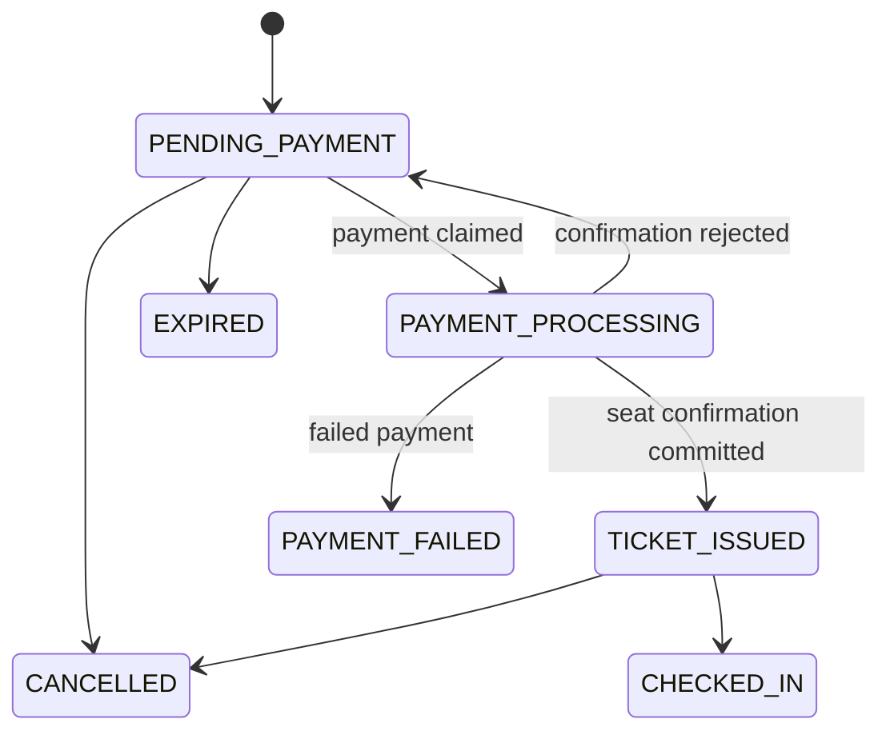

# ACID guarantees for the booking flow

This project now treats PostgreSQL as the authoritative durable state. Redis
still provides short-lived seat holds only; it is not the record of a sale.

## What is guaranteed

- **Atomicity:** creating a booking and recording its outgoing events happen in
  one booking-database transaction. Analytics records its inbox event and all
  affected aggregates in one analytics-database transaction. A failed write
  rolls back the whole unit of work.
- **Consistency:** database constraints reject invalid booking statuses, a
  negative total, malformed booking JSON, an assignment for an unknown seat,
  and a `BOOKED`/`BLOCKED` row with an invalid booking-code shape.
- **Isolation:** a booking transition uses the persisted `version` plus the
  expected prior status. Seat confirmation uses row locks and the unique
  `(trip_id, seat_id)` key, so a contested multi-seat confirmation commits all
  seats or none of them.
- **Durability:** `booking_outbox` persists events before they are published.
  Its dispatcher leases rows with `FOR UPDATE SKIP LOCKED`, retries a broker
  failure, and publishes the same `eventId` on each retry. Consumers can safely
  de-duplicate with their inbox; analytics already does so.
- **Cross-service compensation:** a seat-release command for payment failure,
  expiration, or cancellation is also an outbox row. A transient gRPC failure
  therefore leaves a retryable command rather than a permanently stranded seat.

## State flow

`PAYMENT_PROCESSING` makes a retry after a process failure safe: confirming the
same booking code is idempotent in the seat service, then the booking can finish
the transition to `TICKET_ISSUED`.

## Operating notes

Run `npm run db:migrate` before deploying the changed services. The dispatcher
runs inside booking-service and will deliver any committed but unpublished
outbox rows after a restart.

The booking, seat, analytics and broker systems are separate resources, so a
single distributed SQL transaction is deliberately not attempted. The design
uses transactional outbox, idempotent confirmation and consumers, and explicit
state transitions instead; this provides reliable at-least-once delivery with
no lost committed business event.
