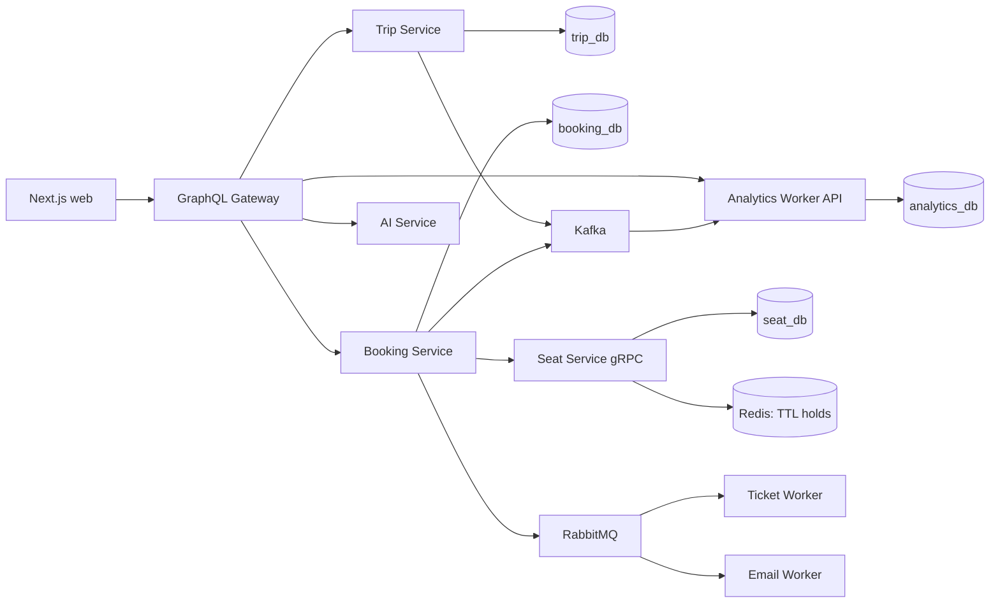

# Kiến trúc backend — Bus AI Ticketing

## Tổng quan

Hệ thống dùng microservice theo nguyên tắc **mỗi service sở hữu dữ liệu của
mình**. PostgreSQL là nơi lưu dữ liệu bền vững; Redis chỉ dùng cho phiên giữ ghế
có TTL. Gateway là điểm vào duy nhất của web client và không truy cập database
trực tiếp.



## Trách nhiệm module

| Thành phần | Trách nhiệm | Database sở hữu |
|---|---|---|
| `trip-service` | Catalogue, tuyến, phương tiện, chuyến và tìm kiếm | `trip_db` |
| `booking-service` | Tài khoản demo, hành khách lưu, booking, vé điện tử | `booking_db` |
| `seat-service` | Xác nhận/khóa ghế qua gRPC | `seat_db` |
| Redis | Hold ghế có TTL 5 phút, không phải dữ liệu bền vững | — |
| `analytics-worker` | Consumer Kafka, báo cáo doanh thu và tuyến phổ biến | `analytics_db` |
| `gateway` | GraphQL BFF; chuyển tiếp request đến service chủ sở hữu | Không có |

## Luồng đặt vé

1. Next.js gọi GraphQL Gateway để lấy chuyến từ Trip Service.
2. Người dùng chọn ghế; Gateway gọi Booking Service, rồi Booking gọi Seat
   Service qua gRPC.
3. Seat Service tạo Redis key `seat:hold:*` theo TTL. Ghế bền vững chỉ được ghi
   vào `seat_db` khi thanh toán thành công.
4. Booking Service lưu booking vào `booking_db`, xác nhận ghế, rồi phát event
   `BookingPaid`/`PaymentSucceeded`.
5. RabbitMQ kích hoạt phát vé/email; Kafka cập nhật analytics idempotent nhờ
   `event_id` trong `analytics_events`.

## Tương tác PostgreSQL

Docker khởi tạo bốn database logic trong cùng một PostgreSQL instance. Các job
`*-migrate` chạy migration SQL versioned một lần trước khi service khởi động;
`trip-migrate`, `booking-migrate` và `analytics-migrate` tiếp tục chạy seed
idempotent. Service khác không dùng bảng của service đó. Các repository nằm
cạnh service (`src/repository.js`) để tách I/O SQL khỏi HTTP/gRPC handler.

- `trip_db`: `routes`, `vehicles`, `trips`.
- `booking_db`: `users`, `saved_passengers`, `bookings`; danh sách hành khách
  và ticket lưu JSONB theo booking.
- `seat_db`: `seat_assignments` với khoá chính `(trip_id, seat_id)`.
- `analytics_db`: event inbox idempotent và các bảng aggregate.

## Chạy bằng Docker

```bash
copy .env.example .env
npm run docker:up
```

Khi chạy PostgreSQL bên ngoài Docker, chạy migration rồi seed trước khi start
service:

```bash
npm run db:migrate
npm run db:seed
```

PostgreSQL mở ở `localhost:5432`; dữ liệu nằm trong Docker volume
`postgres-data`. Không chạy `docker compose down -v` nếu muốn giữ dữ liệu.

## Độ tin cậy hiện có

- Mỗi non-AI service có `grpc.health.v1.Health/Check` và `Watch`; Compose dùng
  `Check` để xác nhận gRPC server sẵn sàng.
- `bus.platform.v1.ServiceRouter` cung cấp cả bốn kiểu gRPC: unary,
  server-streaming, client-streaming và bidirectional-streaming.
- Service chỉ khởi động sau khi PostgreSQL healthy và migration/seed job thành công.
- Redis fallback chỉ dùng khi không cấu hình được môi trường local; Compose
  luôn cấu hình PostgreSQL.
- Analytics bỏ qua event đã xử lý nhờ khoá chính `event_id`.
