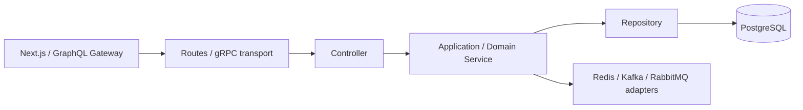

# Layered architecture

Các REST service được tổ chức theo hướng `Routes → Controllers → Services →
Repositories`. Điều này tách HTTP/gRPC transport khỏi business rule và I/O
database, đồng thời giữ nguyên GraphQL contract cho Next.js.

## Hiện thực

| Layer | Ví dụ |
|---|---|
| Routes | `services/trip-service/src/routes/trip-routes.js` |
| Controllers | `services/trip-service/src/controllers/trip-controller.js`; `services/seat-service/src/controllers/seat-grpc-controller.js` |
| Services | `services/trip-service/src/services/trip-service.js`; `services/seat-service/src/core.js` |
| Repositories | `services/*/src/repository.js` |
| Infrastructure adapters | `packages/shared/src/cache.js`, `broker.js`, `postgres.js` |
| API/BFF boundary | `services/gateway/src/index.js` GraphQL resolvers |

`index.js` của service chỉ là **composition root**: nạp configuration,
khởi tạo dependency và ghép routes/controllers/services/repositories. Business
logic như validation, search/cache invalidation, CRUD và publish event nằm trong
service layer; controller không chứa rule nghiệp vụ.

Booking Service đã có repository tách riêng và là application orchestrator cho
gRPC/RabbitMQ/Kafka. Có thể tiếp tục tách các HTTP handler của service này theo
cùng mẫu Trip Service khi cần mở rộng thêm endpoint.
